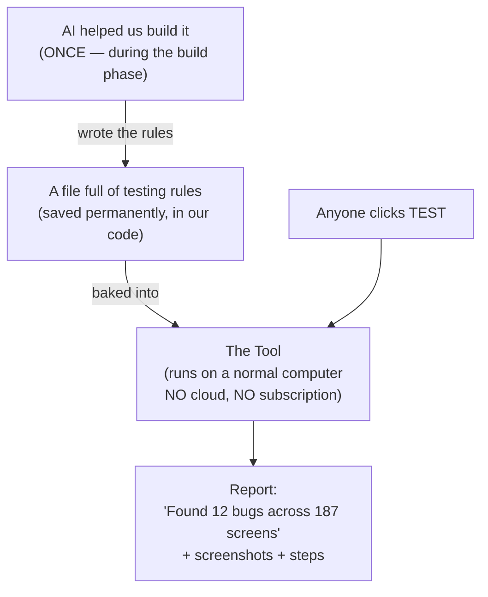

# How to Explain the Stratus QA Tool — A Pitch Script

> A simple, jargon-free script you can use to explain the testing tool
> to anyone — a manager, a new hire, a client, or your mom.
>
> No coding terms. Just plain English.

---

## 1. The 30-second pitch (memorize this)

Use this whenever someone says *"so what does your tool do?"*

> *"Stratus has hundreds of screens. Right now, every time the developers
> change something, someone from QA has to manually click through every
> screen to make sure nothing broke. That takes weeks.*
>
> *I built a tool that does the clicking automatically. We trained it
> once — using AI as the trainer — and now it knows every kind of screen
> in Stratus and what tests to run on each one. The tool runs on a
> regular computer. No cloud. No subscription. No monthly bill.*
>
> *Anyone on the team can run it. You paste the website address, paste
> the password, click one button. A few hours later you get a report:
> here are the bugs, here are the screenshots, here's where to find them."*

That's the whole thing. **One paragraph. 30 seconds.**

---

## 2. The "trained employee" analogy (when they want to understand HOW)

This is the analogy that lands. Use it when someone asks *"but how does
the tool know what to test?"*

> *"Think of it like hiring a brilliant employee and training them for
> three months. After that, they know your business inside and out.
> They go to work every day, they don't ask questions, they just do the
> job — for years.*
>
> *That's our tool. We spent the training period — the build phase — using
> AI as the teacher. The AI looked at Stratus, studied every kind of
> screen, wrote down all the rules: 'a list screen has these patterns,
> a form has these patterns, a price field should be tested with
> negative numbers, an SKU field should be tested for duplicates.'*
>
> *Once that training was written down, the AI's job was done. We saved
> all those rules in a file. Now the tool reads those rules and tests
> Stratus on its own — no cloud connection, no AI bill, no subscription.*
>
> *It's like the difference between paying a consultant by the hour
> forever, versus paying once for the consultant's playbook."*

---

## 3. The picture for a whiteboard

**The key sentence to say while pointing at the diagram:**

> *"The AI is on the LEFT side — used once, finished. Once we built the
> rule book, the AI is no longer needed. The tool on the RIGHT side runs
> forever, on a normal computer, with no ongoing cost."*

---

## 4. The 3-step "how do I actually use it" pitch

When someone says *"OK, so how would I use this?"* — give them exactly
**3 steps**.

> *"**Step 1.** Open the tool. You see one screen with two text boxes.*
>
> ***Step 2.** Paste the website address (like 'dev-stratus.company.com')
> and your QA username and password.*
>
> ***Step 3.** Click TEST. Walk away. Come back in a few hours or come
> in the next morning.*
>
> *The tool reads its built-in rule book, walks through every screen in
> Stratus, tries different kinds of input — like a real tester would —
> takes screenshots, checks the database, and writes you a report.*
>
> *That's the whole job. No coding. No setup. No cloud."*

---

## 5. Common questions and how to answer them

| If they ask… | You say… |
|---|---|
| *"Can't we just hire more manual testers?"* | "Sure, but every release we'd have to test all 200 screens again. The tool does that overnight, automatically, for free. People sleep, the tool doesn't." |
| *"What about that AI testing thing — Mabl or testRigor?"* | "Those tools cost $30,000 to $100,000 every year, forever. Our tool costs us once to build, then $0 every year after. Same idea, way better economics." |
| *"What if our app changes a lot?"* | "When a new screen appears, the tool figures it out on its own — that's what the built-in rules are for. When a brand-new *type* of screen ships (rare — happens once a year), we add one rule to the rule book. Five minutes." |
| *"Why is there no monthly cost?"* | "Because we use AI once — during the build — to write down all the rules the tool needs. After that, the tool just reads the rules. It doesn't call the cloud. No API fees." |
| *"What if the AI we used goes out of business?"* | "Doesn't matter. The rules they helped us write live in our code. The tool doesn't talk to any AI service to run." |
| *"What about screens with money — payments, receipts?"* | "Those get special treatment. A senior QA writes the exact test for each money flow, and engineering reviews it. The auto-tool is not allowed to touch them. Money flows demand certainty, not best-guess." |
| *"What if a screen is really unusual?"* | "Then we write that one screen by hand — plain Python — the old way. About 5% of screens end up here. The rest are auto-tested." |
| *"How long to build for the whole project?"* | "About fourteen weeks with two engineers. After that, we spend nothing. The tool just runs." |
| *"What happens when a test fails?"* | "Three things: a screenshot of the screen at the moment of failure, a short video of the whole test, and the exact error. You can tell in 60 seconds whether it's a real bug or a flaky test." |
| *"Does it know our business rules?"* | "Yes — there's a file we update as a team. Things like 'consignor must be 18+', 'negative prices should be rejected'. It's a few lines of plain text. Anyone can add to it." |
| *"Who maintains the tool itself?"* | "An automation engineer, part-time. The bulk of the rules don't change — Stratus' patterns are stable. Maintenance is occasional, not constant." |

---

## 6. The hallway one-liner

For when someone walks by and asks *"hey what are you working on?"* —
you have 10 seconds.

> *"A tool that auto-tests every screen in Stratus from a single button
> click. Built once with AI. Runs forever with no subscription."*

**18 words. The whole thing.**

---

## 7. The progression — pick the right version for the moment

| You have… | Use the… |
|---|---|
| 10 seconds | One-liner (§6) |
| 30 seconds | The pitch (§1) |
| 2 minutes | Pitch + trained-employee analogy (§1 + §2) |
| 5 minutes | Pitch + analogy + whiteboard diagram + 3 steps (§1 + §2 + §3 + §4) |
| 15 minutes | All of the above + walk through one real Q&A from §5 |
| 30 minutes | Open the Quickstart guide and add a real screen together |

---

## 8. What NOT to say

Avoid these — they make people's eyes glaze over and they don't help
your case:

- ❌ "YAML"
- ❌ "Heuristics"
- ❌ "Pattern engine"
- ❌ "Pytest"
- ❌ "Playwright"
- ❌ "Page Object Model"
- ❌ "CI/CD pipeline"
- ❌ "Hibernate"
- ❌ "Schema-driven"
- ❌ "LLM"
- ❌ "Computer-use agent"

**Use these instead:**

- ✅ "Rule book"
- ✅ "The tool"
- ✅ "Trained once"
- ✅ "Runs on a normal computer"
- ✅ "No subscription"
- ✅ "No cloud connection"
- ✅ "Screen-by-screen testing"
- ✅ "Nightly check"
- ✅ "The database"

The technical words only help when you're talking to engineers. For
everyone else, the simple words *land*.

---

## 9. The "money sentence" — how it beats commercial tools

When you're pitching to a manager or owner, the strongest single
sentence in the entire pitch is this:

> *"A commercial AI testing tool costs thirty to a hundred thousand
> dollars every year. Ours cost once to build, then zero. After year one
> we're already saving money. After year five we've saved over a hundred
> thousand."*

Say it slowly. Watch their face. That sentence wins meetings.

---

## 10. The closing line (use this to end a pitch)

> *"It turns testing from something only one or two people can do — slowly,
> by hand — into something the whole team can run on demand, that costs
> us nothing to keep using, on every screen, forever."*

That's the win. Say it slowly. Let it sit.

---

## 11. Quick reference card — print and keep on your desk

**WHAT IT IS:**
A tool that automatically tests every screen in Stratus.

**WHO USES IT:**
Anyone on the team. No coding.

**HOW THEY USE IT:**
1. Paste website address.
2. Paste credentials.
3. Click TEST.

**WHAT IT CHECKS:**
- The screen (clicks, fills, submits)
- The network (the right call was made)
- The database (the data was really saved)

**WHAT MAKES IT DIFFERENT:**
- **Built once** — AI helped during the build phase, then it's done
- **Runs on a normal computer** — no cloud, no subscription
- **Zero ongoing cost** — no API fees, no monthly bill, ever
- **Anyone can use it** — no coding required

**HOW LONG IT TAKES:**
- Building the whole tool: 14 weeks (one time)
- Adding one new screen: 0 minutes (the tool figures it out)
- A nightly test run: 30-60 minutes — unattended

**WHY IT'S BETTER:**
- vs hand-coding: 200 fewer broken files
- vs hiring more testers: never sleeps, never gets bored
- vs commercial AI tools: saves $90-180k over 5 years
- vs LLM-at-runtime tools: no per-test API bills

---

*Want to see what the tool actually looks like when it runs, or how a
real test run produces its report? Open the [Quickstart for QA](quickstart-for-qa.md).
Want the architecture details? Open the [Architecture guide](architecture.md).*
