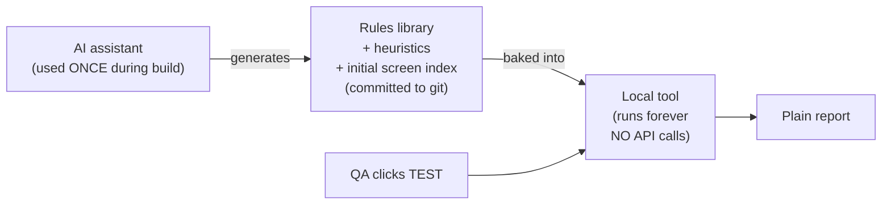
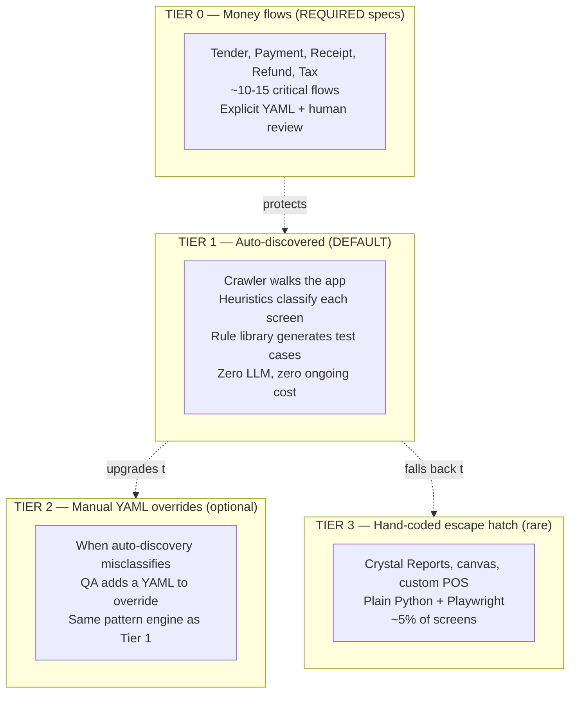
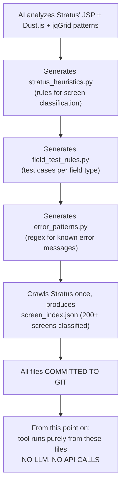
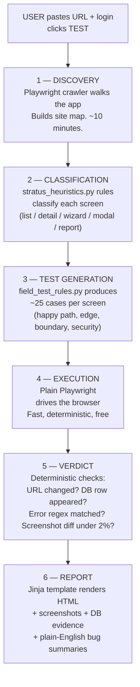
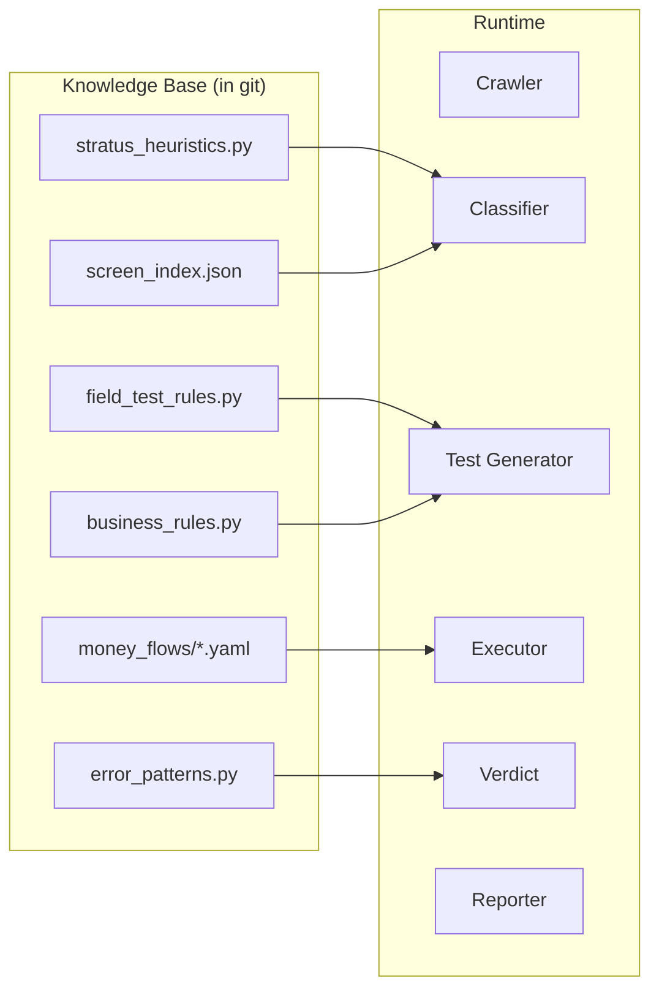
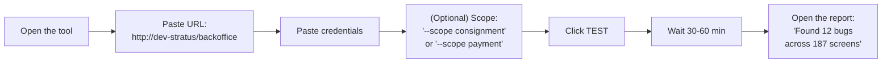
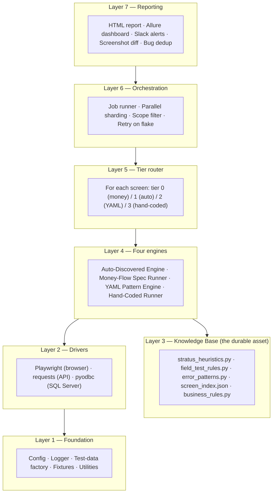
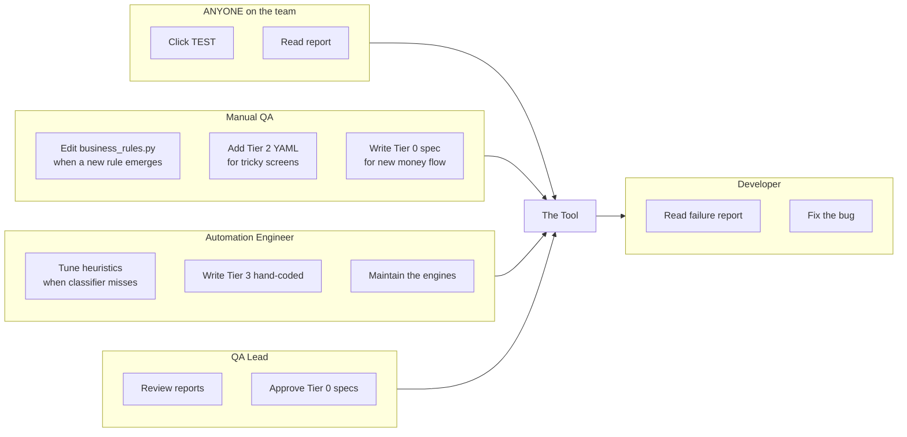
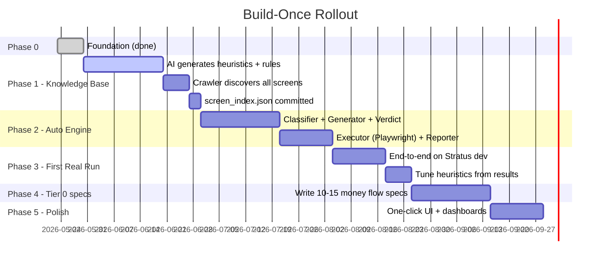
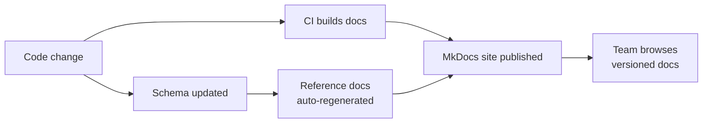

# Stratus QA Automation Platform — Architecture & Design

> **Audience:** leads, automation engineers, and anyone evaluating the approach.
> Manual QA team — you don't need to read this; jump to the
> [Quickstart for QA](quickstart-for-qa.md). Come back here when you're curious
> *why* the tool works the way it does.

> **Design principle:** *Built once. Runs forever. No subscriptions, no API
> bills, no per-test costs.* AI is used **once during the build phase** to
> generate the rules and heuristics. After that, the tool runs purely on
> deterministic local code. Nothing calls the cloud at runtime.

---

## Table of contents

1. [The problem at real scale](#1-the-problem-at-real-scale)
2. [The big idea — Build Once, Run Forever](#2-the-big-idea)
3. [The economic constraint that shaped this design](#3-the-economic-constraint)
4. [The three tiers — Money / Auto-discovered / Manual](#4-the-three-tiers)
5. [The setup phase — used once, then never again](#5-the-setup-phase)
6. [How the tool works at runtime (zero API calls)](#6-how-the-tool-works-at-runtime)
7. [The Knowledge Base — what gets committed to git](#7-the-knowledge-base)
8. [How a user actually uses it](#8-how-a-user-actually-uses-it)
9. [Layered architecture](#9-layered-architecture)
10. [Tier 0 — money-flow specs (required)](#10-tier-0--money-flow-specs)
11. [Tier 1 — auto-discovered (the default)](#11-tier-1--auto-discovered)
12. [Tier 2 — manual YAML overrides (when auto is wrong)](#12-tier-2--manual-yaml-overrides)
13. [Tier 3 — hand-coded escape hatch](#13-tier-3--hand-coded-escape-hatch)
14. [Folder structure](#14-folder-structure)
15. [Personas](#15-personas)
16. [Honest tradeoffs — build-once vs LLM-at-runtime](#16-honest-tradeoffs)
17. [Cost model — zero ongoing](#17-cost-model)
18. [Rollout plan](#18-rollout-plan)
19. [Documentation strategy](#19-documentation-strategy)
20. [Why this approach vs alternatives](#20-why-this-approach)
21. [Risks and mitigations](#21-risks-and-mitigations)
22. [Glossary pointer](#22-glossary-pointer)
23. [Appendix A — Mapping to Stratus' real architecture](#appendix-a)
24. [Appendix B — One-page exec summary](#appendix-b)

---

## 1. The problem at real scale

Stratus BackOffice has hundreds of screens. Every release, someone has to
verify none of them broke. The traditional answers all fail at this scale:

| Approach | Why it fails |
|---|---|
| Manual regression by QA team | Takes weeks per release. People miss things. Doesn't scale. |
| One hand-coded automated test per screen | 200+ Python files; each breaks differently when JSP changes. |
| Generic record/playback (Selenium IDE) | No version control, no parameterization, dies in 6 months. |
| Commercial AI testing tool | $30-100k per year forever. Vendor lock-in. Still needs setup. |
| **LLM-driven testing at runtime** | **Per-night API bill grows with screen count. If you can afford the LLM, you could just pay a QA salary instead.** |
| **Build-once, deterministic tool (this design)** | **One-time build cost, then zero ongoing cost. Decades of value from a single investment.** |

---

## 2. The big idea



The AI is a **consultant we hire once**, not an employee on the payroll
forever. It produces a rules library, that library gets committed to git,
and from that day forward the tool runs purely on local deterministic
code. Nothing dials out. No tokens. No bills.

This matches the SQL agent pattern: AI helped build it, then it runs
locally on its own.

---

## 3. The economic constraint

A test automation tool is only valuable if it eliminates ongoing cost,
not just shifts it from people to APIs. Two failure modes to avoid:

| Trap | Why it's a trap |
|---|---|
| **"Just use the LLM at runtime"** | $50-100 per nightly run = $20-36k/year. At that price you could just hire another QA. The tool replaced a recurring cost with another recurring cost. |
| **"Buy a commercial AI testing tool"** | $30-100k/year. Vendor lock-in. Same problem, more expensive. |

The math we want:

| | One-time | Annual ongoing |
|---|---|---|
| **Build the tool** | ~14 weeks × 2 engineers | $0 |
| **Maintain the tool** | — | Code changes only when Stratus changes |
| **Run nightly regression** | — | **$0** |
| **Add a brand-new screen** | — | 0 minutes (auto-discovered) |

That's the bar. Anything else is just renting intelligence by the hour.

---

## 4. The three tiers



| Tier | What | Who maintains | Coverage | Runtime cost |
|---|---|---|---|---|
| **0 — Money flows** | Explicit specs for ~10-15 critical financial flows | Senior QA + Eng | ~5% of screens, 80% of business risk | $0 |
| **1 — Auto-discovered (default)** | Deterministic crawler + heuristic classifier + rule-based test generator | Nobody — runs itself | ~80% of screens | $0 |
| **2 — Manual YAML overrides** | QA adds a YAML when auto-discovery gets a screen wrong | Manual QA when needed | ~10% of screens | $0 |
| **3 — Hand-coded** | Python tests for genuinely weird screens | Automation engineer | ~5% of screens | $0 |

Every tier runs locally. Every tier costs $0 per night. The only ongoing
cost is electricity.

---

## 5. The setup phase

This is the one-time AI-assisted build. **Happens once** during Phase 1.
After this, AI is not in the loop anymore.



### What gets generated, once

| File | What it contains | Lines (est.) |
|---|---|---|
| `stratus_heuristics.py` | Python rules: "if DOM contains `<table class="jqgrid">` → list screen. If it has `<div class="wizard-step">` → wizard…" | ~300 |
| `field_test_rules.py` | "For `type=number, min=0` → test 0, -1, 0.01, 999999999, empty, 'abc'. For `type=text, maxlength=50` → test 0, 1, 50, 51, 100, unicode, SQL injection patterns…" | ~400 |
| `error_patterns.py` | Regex library: known Stratus error message patterns and how to recognize them | ~150 |
| `screen_index.json` | Static index of every screen the crawler found, with its classification | ~200 entries |
| `business_rules.py` | Stratus-specific rules ("consignor must be 18+", "negative prices rejected") | ~100 |

**Total:** ~1,200 lines of code, written once, used forever.

After this is done, anyone on the team can `git pull` and have a working
testing tool. No API keys. No cloud setup. No subscriptions.

---

## 6. How the tool works at runtime

The same six-step pipeline as a smart AI agent — but every step is
**deterministic local code**.



### What each step uses (and does NOT use)

| Step | Uses | Does NOT use |
|---|---|---|
| 1. Discovery | Playwright + Python | LLM, vision API |
| 2. Classification | DOM inspection rules in Python | LLM, vision API |
| 3. Test generation | Static rule library | LLM, reasoning API |
| 4. Execution | Playwright | Computer-use agent, LLM |
| 5. Verdict | URL diff, DB query, regex match, screenshot pixel-diff | LLM judge |
| 6. Report | Jinja2 templates + pre-written bug-description templates | LLM writer |

Total external API calls per run: **0**.

---

## 7. The Knowledge Base

The Knowledge Base is the set of files generated during setup and
committed to git. It is the durable, valuable artifact of the project.



**The Knowledge Base lives forever.** When Stratus adds a new screen
type, you update one rule in `stratus_heuristics.py` (a 5-minute change)
and commit. The tool now handles that new screen type forever, at no
runtime cost.

This is the difference between **owning** intelligence and **renting**
it.

---

## 8. How a user actually uses it



**Workflow:** paste, click, wait, read. Same as before. The user
experience does not change. What changed is what's inside the box.

For the remaining 20%:

- **New money flow** → senior QA writes a Tier 0 YAML
- **Auto-discovery misclassifies a screen** → QA writes a Tier 2 YAML
- **Genuinely weird screen** → automation engineer writes Tier 3 Python

These are **escalations**, not the default.

---

## 9. Layered architecture



**Note:** Layer 3 (Knowledge Base) is now the durable centerpiece. It
replaces what was previously an LLM client.

---

## 10. Tier 0 — money-flow specs

The protected layer. **Required**, not optional.

These flows touch money or compliance — tender, payment, receipt,
refund, tax calculation, frequent-buyer credit, trade credit. Bugs here
are reputational and legal incidents, not just inconveniences.

For each Tier 0 flow:

- A senior QA writes an explicit YAML spec (specific amounts,
  specific expected DB rows, specific receipt outputs)
- Engineering reviews it
- Auto-discovery is **not allowed** to mutate the spec
- Test runs are deterministic and reproducible
- A failure pages someone immediately

### Example: `money_flows/credit_card_tender.yaml`

```yaml
flow:
  id: credit_card_tender
  tier: 0
  owners: [senior_qa@example.com, eng_lead@example.com]
  pages_on_failure: true

scenarios:
  - id: TC-CC-01
    name: "Authorize and capture $42.13 on a Visa"
    steps:
      - login: { user: pos_user, store: "001" }
      - open: { screen: pos_main }
      - add_item: { sku: "TEST-SKU-42", qty: 1 }
      - tender: { type: visa, amount: 42.13, last4: "4242" }
      - confirm
    expect:
      ui:
        - { selector: "#receiptTotal", equals: "42.13" }
        - { selector: "#authCode",     matches: "^\\d{6}$" }
      db:
        - "SELECT total FROM Receipt WHERE id = ?"
          equals: 42.13
        - "SELECT auth_code FROM TenderLine WHERE receipt_id = ?"
          matches: "^\\d{6}$"
```

Maybe 10-15 of these get written, total, for the whole project. They
take a day each. They never change unless the business rule changes.

---

## 11. Tier 1 — auto-discovered

The default. Covers ~80% of screens with **zero ongoing setup**.

The tool runs the full six-step pipeline (discovery → classification →
test generation → execution → verdict → report) for every screen the
crawler finds.

All intelligence comes from the **Knowledge Base** files committed to
git. The tool never makes an external call.

### Adding a new screen

When developers ship a new screen:

1. They commit and deploy.
2. That night, the crawler walks the app and finds the new URL.
3. The classifier inspects its DOM and tags it (list / detail / etc.).
4. The test generator produces ~25 cases for it.
5. The executor runs them.
6. The report shows results in the morning.

**Zero QA work was required.** This is the promise of build-once.

### When auto-discovery is wrong

Sometimes a screen confuses the classifier — maybe it has a custom layout
the heuristics don't recognize. Two options:

- **Quick fix:** add one rule to `stratus_heuristics.py` (5 minutes,
  fixes that screen + every future screen like it)
- **Per-screen override:** write a Tier 2 YAML for that one screen

The first option is preferred when the misclassification is general.

---

## 12. Tier 2 — manual YAML overrides

The same pattern engine concept, but now opt-in rather than the default.

When you write a Tier 2 YAML:

```yaml
screen:
  id:   sku_detail
  type: detail
  tier: 2                           # forces this tier instead of auto
  url:  /stratus?screenType=skuDetail&id={sku_id}

detail:
  fields:
    - { name: skuId, selector: "#skuId", type: text, required: true }
    - { name: price, selector: "#skuPrice", type: decimal, min: 0 }
  buttons:
    save: { selector: "#btnSave", on_success: "navigates_to_list" }
```

The pattern engine runs deterministic tests against this spec. Same as
Tier 1, but with the screen's structure manually specified instead of
inferred.

See [Quickstart for QA](quickstart-for-qa.md) for the full YAML
authoring guide.

---

## 13. Tier 3 — hand-coded escape hatch

Plain Python + Playwright in `tests/custom/`. For the 5% of screens that
genuinely don't fit any pattern:

- Crystal Reports viewer (custom iframe, embedded JS controls)
- Receipt designer (canvas-based drag/drop)
- Multi-window POS checkout (popup management)
- Third-party payment iframes

This tier guarantees we can say "yes, every screen is tested" — even
when the other three tiers can't reach a particular screen.

---

## 14. Folder structure

```
qa-automation/
├── README.md                            ← top-level quickstart
├── docs/                                ← docs site (MkDocs)
│   ├── index.md
│   ├── architecture.md                  ← this document
│   ├── quickstart-for-qa.md             ← non-coder how-to
│   ├── PITCH.md                         ← simple explainer
│   ├── glossary.md
│   └── word/                            ← Word versions of all docs
│
├── requirements.txt
├── pytest.ini
├── .env.example
├── conftest.py
│
├── stratus_qa/                          ← THE FRAMEWORK
│   ├── config/
│   ├── drivers/
│   │   ├── ui_driver.py                 ← Playwright wrapper
│   │   ├── api_driver.py                ← /stratus client
│   │   └── db_driver.py                 ← SQL Server helper
│   ├── engines/
│   │   ├── auto_discovery/              ← TIER 1 — six-step pipeline
│   │   │   ├── crawler.py
│   │   │   ├── classifier.py
│   │   │   ├── generator.py
│   │   │   ├── executor.py
│   │   │   ├── verdict.py
│   │   │   └── reporter.py
│   │   ├── money_flow_runner.py         ← TIER 0
│   │   ├── yaml_pattern_engine.py       ← TIER 2
│   │   └── hand_coded_runner.py         ← TIER 3
│   ├── tier_router.py                   ← chooses tier per screen
│   ├── cli/
│   │   ├── test.py                      ← `stratus-qa test` (the button)
│   │   ├── crawl.py                     ← rebuild screen_index.json
│   │   ├── new_screen.py                ← scaffold a Tier 2 YAML
│   │   ├── validate.py
│   │   └── doctor.py
│   └── reporting/
│
├── knowledge_base/                      ← THE DURABLE ASSET
│   ├── stratus_heuristics.py            ← screen classification rules
│   ├── field_test_rules.py              ← test cases per field type
│   ├── error_patterns.py                ← known error regex
│   ├── screen_index.json                ← every screen, classified
│   └── business_rules.py                ← Stratus-specific rules
│
├── money_flows/                         ← TIER 0 — ~10-15 specs (REQUIRED)
│   ├── credit_card_tender.yaml
│   ├── cash_tender.yaml
│   ├── refund.yaml
│   └── tax_calculation.yaml
│
├── catalog/                             ← TIER 2 — optional YAMLs
│   └── (only when auto-discovery is wrong)
│
├── tests/
│   ├── conftest.py
│   ├── custom/                          ← TIER 3 — hand-coded
│   ├── smoke/                           ← critical-path checks
│   └── generated/                       ← cached generated tests
│
└── reports/                             ← run artifacts (git-ignored)
    ├── report.html
    ├── allure-results/
    ├── screenshots/
    └── videos/
```

---

## 15. Personas



| Persona | Day-1 productivity | Touches |
|---|---|---|
| **Manual QA** | Hour 1 (click TEST) | business_rules.py, optionally YAML |
| **QA Lead** | Day 1 (read reports) | dashboard, Tier 0 approvals |
| **Automation Eng** | Week 2 | heuristics, Tier 3 Python |
| **Developer** | Hour 1 | nothing in the test framework |
| **Anyone** | Five minutes | the tool |

---

## 16. Honest tradeoffs

If a vendor pitched you LLM-at-runtime testing without mentioning these,
walk away.

| LLM-at-runtime gives | Build-once gives | Worth the trade? |
|---|---|---|
| Auto-adapts to brand-new screen types we've never seen | Add a heuristic rule (5 min) when a genuinely new type ships | ✅ Yes — happens once a year, not daily |
| "Smart" edge case generation per screen | Generic edge cases per field type | ✅ Yes — generic catches 90%+ of bugs |
| Plain-English bug descriptions | Templated bug descriptions | ✅ Yes — templated is more consistent |
| Self-healing via vision | Multiple selector fallbacks (id → name → label) | ✅ Yes — works for 95% of breakage |
| No initial setup | One-time build (14 weeks) | ✅ Yes — pay once, save forever |
| **$20-36k/year ongoing** | **$0/year ongoing** | ✅ Always yes |

The honest summary: we trade "infinitely flexible but expensive forever"
for "very flexible and free forever." That's a great trade for an
enterprise system that will run for years.

---

## 17. Cost model

| Cost item | LLM-at-runtime | **Build-once (this design)** |
|---|---|---|
| One-time build | 8 wk × 2 eng | **14 wk × 2 eng** |
| One-time AI consulting (rules generation) | — | **~$200 total** |
| Per nightly run | $50-100 | **$0** |
| Per month | $1,500-3,000 | **$0** |
| Per year | $18,000-36,000 | **$0** |
| 5-year ongoing total | $90,000-180,000 | **$0** |
| Tool maintenance | LLM API changes break tests | Code changes only when Stratus changes |
| If LLM provider goes down | Tests can't run | Tests run as normal |
| If budget gets cut | Tool stops working | Tool keeps working |

**Build-once costs +6 extra build weeks upfront and saves $90-180k over
5 years.** Even at the lowest LLM pricing tier, the math is overwhelming.

---

## 18. Rollout plan



| Phase | Length | Deliverable |
|---|---|---|
| **0 — Foundation** | 1 wk | ✅ done |
| **1 — Knowledge Base** | ~4 wk | AI generates heuristics, rules, screen index. **Committed to git. AI exits the project.** |
| **2 — Auto-Discovery Engine** | ~5 wk | Six-step pipeline working end-to-end against a test app |
| **3 — First Real Run** | ~3 wk | Engine runs against Stratus dev, produces real report, heuristics tuned |
| **4 — Tier 0 specs** | ~3 wk | 10-15 money-flow specs written and green in CI |
| **5 — Polish** | ~2 wk | One-click UI, dashboards, alerting |

**Total: ~14 weeks** with 2 engineers. End state: anyone on the team can
test the entire BackOffice by pasting a URL and clicking a button, with
**zero ongoing cost** for the lifetime of the tool.

---

## 19. Documentation strategy



| Document | Audience | Format | Update trigger |
|---|---|---|---|
| **Quickstart for QA** | Day-1 hires | Markdown + screenshots | New CLI command |
| **Architecture (this)** | Leads, engineers | Markdown + Mermaid | Framework redesign |
| **PITCH** | Anyone explaining to non-technical people | Markdown | Major pitch refresh |
| **Knowledge Base reference** | Anyone updating heuristics or rules | Cookbook style | New rule pattern |
| **Tier 0 spec reference** | QA writing money flows | Schema reference | Spec format change |
| **Cookbook** | "How do I…?" recipes | Q&A format | New recipe added |
| **Troubleshooting** | When stuck | Symptom → fix table | Each known issue |

Hosted via **MkDocs** with Material theme. Diagrams are **Mermaid** so
they version with the code.

---

## 20. Why this approach

| Alternative | Why we reject it |
|---|---|
| Manual regression only | Doesn't scale; humans miss things; weeks per release |
| Hand-coded Page Object per screen | 200 files of broken code as JSP changes |
| Pure YAML pattern engine (per-screen setup) | Adoption suffers — every new screen needs a QA to write a YAML |
| LLM at runtime | $20-36k/year ongoing. If we can afford the LLM, we could hire another QA. |
| Commercial AI tool (Mabl, testRigor, Reflect) | $30-100k/year + vendor lock-in |
| Pure computer-use agent | Slow, expensive, fragile on jQuery-heavy JSP screens |
| **This — build-once with three tiers** | **Pay once, save forever. AI used for the durable artifact, not the recurring spend.** |

---

## 21. Risks and mitigations

| Risk | Likelihood | Impact | Mitigation |
|---|---|---|---|
| Heuristics get a brand-new screen wrong | Medium | Low | Quick 5-minute rule addition to `stratus_heuristics.py` |
| Field rules miss a sneaky edge case | Medium | Medium | QA adds the case to `field_test_rules.py` — fix benefits all future screens |
| Knowledge Base becomes stale | Medium | Medium | Crawler re-runs nightly, flags screens whose classification changed |
| Self-healing selector picks wrong fallback | Low | Low | Every fallback choice logged + visible in report |
| Tests pollute DB with junk data | Medium | Medium | Each test in a transaction or uses unique-ID test data |
| Same bug found Tuesday, missed Wednesday | Low (deterministic) | Low | Tier 0/2 deterministic by design; Tier 1 also fully deterministic |
| Stratus is rewritten on a new framework | Low | High | Heuristics file gets rewritten once (~1 day) for the new framework |
| Tool breaks because Playwright API changes | Low | Medium | Pin Playwright version; upgrade once per quarter |
| Devs stop adding `data-test` attrs | High | Low | Heuristics work fine without them; selector fallbacks cover gaps |

---

## 22. Glossary pointer

If any term in this document is unfamiliar, see [Glossary](glossary.md).
It explains every term in plain English — no prior knowledge assumed.

---

## Appendix A

### Mapping to Stratus' real architecture

How each tier interacts with Stratus' actual components:

| Stratus piece | How it's tested |
|---|---|
| `WebContent/login.jsp` + `UserAuthenticationServlet.do` | Tier 1 crawler handles login; explicit test in `tests/smoke/` |
| `StratusServlet` (`/stratus` dispatcher) | Tier 1 discovers screenTypes by crawling; Tier 0 specs hit specific dispatchers for money flows |
| JSP + jQuery + Dust.js + jqGrid | Tier 1 inspects rendered DOM with `stratus_heuristics.py`; Tier 2 YAMLs supplement when jqGrid is brittle |
| Hibernate entities (Receipt, TradeCard, Sku, Customer, …) | DB verifier confirms persistence (Tier 0/1/2) |
| `CrystalReportViewerHandler` | Tier 3 hand-coded |
| TSYS / Shift4 card processors | Tier 0 specs with sandbox creds |
| Crystal Reports rendering | Tier 3 hand-coded |

---

## Appendix B

### One-page exec summary

> **Problem:** Stratus has hundreds of screens. Manual regression takes
> weeks per release; hand-coded automation grows to 200 unmaintainable
> Python files; LLM-at-runtime testing costs $20-36k/year forever and
> can be replaced by hiring another QA at the same price.
>
> **Solution:** A build-once testing tool. AI is used during the build
> phase (once) to generate a Knowledge Base — heuristics, rules,
> patterns — that gets committed to git. After build, the tool runs
> purely on local deterministic code. User pastes URL + credentials,
> clicks one button, reads a plain-English report. No API calls. No
> subscriptions. No ongoing cost.
>
> **Safety nets:** ~10-15 critical money flows (tender, payment,
> receipt) get explicit human-written specs. The 5% of weird screens
> (Crystal Reports, canvas) get hand-coded tests. Everything else — ~80%
> of the app — runs autonomously via the Knowledge Base.
>
> **Build cost:** ~14 weeks with 2 engineers.
>
> **Operating cost:** $0/year. Forever.
>
> **5-year savings vs LLM-at-runtime:** $90-180k.
>
> **Ongoing per-screen cost:** Zero. New screens get tested the night
> they ship, no setup required.
>
> **Who can use it:** Anyone on the team who can paste a URL and click a
> button. No coding. No API keys. No subscriptions.
