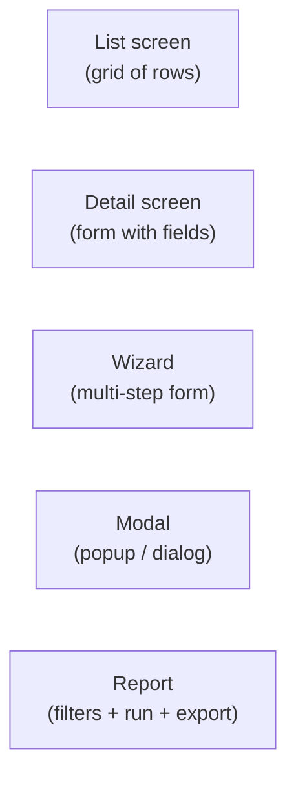
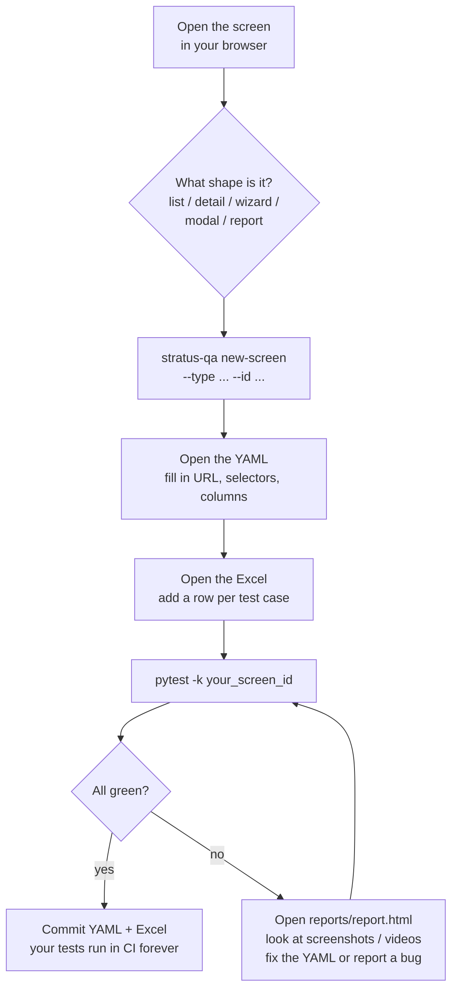

# Quickstart for Manual QA

> Audience: **manual QA team members who have never written code.**
> If you can edit a Word document and an Excel spreadsheet, you can use
> this tool.

This guide walks you through adding **one new screen** to the automated
test suite, end-to-end, in about 30 minutes.

## The promise

By the end of this guide, you will:

1. Pick a screen you want tested (e.g. "Tax Code List").
2. Run one command that creates a starter file for you.
3. Fill in the file in a text editor (just text — no programming).
4. Drop your test cases in an Excel spreadsheet.
5. Run one command to execute ~25 tests automatically.
6. See a nice HTML report with screenshots.

You will never open a Python file. You will never write code.

---

## Table of contents

1. [How the tool thinks about screens](#1-how-the-tool-thinks-about-screens)
2. [Before you start — one-time setup](#2-before-you-start)
3. [Step 1 — Pick the screen](#3-step-1--pick-the-screen)
4. [Step 2 — Create the YAML file](#4-step-2--create-the-yaml-file)
5. [Step 3 — Fill in the YAML](#5-step-3--fill-in-the-yaml)
6. [Step 4 — Write your test cases in Excel](#6-step-4--write-your-test-cases-in-excel)
7. [Step 5 — Run the tests](#7-step-5--run-the-tests)
8. [Step 6 — Read the report](#8-step-6--read-the-report)
9. [Common situations — recipes](#9-common-situations--recipes)
10. [When something goes wrong](#10-when-something-goes-wrong)
11. [Where to ask for help](#11-where-to-ask-for-help)

---

## 1. How the tool thinks about screens

The tool understands **five shapes** of screen. Every screen you ever
test falls into one of them:



Examples in Stratus:

| Shape | Real Stratus screens |
|---|---|
| **list** | Customer List, SKU List, Receipt List, Tax Code List |
| **detail** | Customer Detail, SKU Detail, Employee Detail |
| **wizard** | Buy/Trade Intake, Consignment Intake, POS Checkout |
| **modal** | Login, Override Password, Lookup picker, "Are you sure?" |
| **report** | Sales report, Inventory report, Crystal Reports |

Before you start, **decide which shape your screen is**. That's the
single most important decision — the rest is mechanical.

---

## 2. Before you start

> **One-time setup.** Skip this section if your laptop has already been
> set up by the automation team.

Open **Terminal** (Mac) or **Command Prompt** (Windows) and run:

```bash
cd /path/to/stratus_backoffice_develop/qa-automation
python3 -m venv .venv
source .venv/bin/activate         # Windows: .venv\Scripts\activate
pip install -r requirements.txt
playwright install chromium
cp .env.example .env
```

Open `.env` in any text editor and fill in your DEV environment values:

```ini
APP_BASE_URL=http://dev-stratus.example.com/backoffice
TEST_USER=qa_automation
TEST_PASSWORD=ChangeMe123
DB_HOST=dev-sql.example.com
DB_USER=sa
DB_PASSWORD=YourPassword
DB_NAME=stratus_dev
```

Now run the health check:

```bash
pytest -m smoke
```

If you see **3 green PASSED** lines, you're set. If anything is red, see
[When something goes wrong](#10-when-something-goes-wrong).

---

## 3. Step 1 — Pick the screen

For this guide we'll use **"Tax Code List"** as our example. In your real
work, pick any screen that doesn't have a YAML file yet.

> **Tip:** check `catalog/` to see which screens are already covered.
> Don't duplicate.

Open the screen in your browser, log in, and **just look at it for a
moment**. Ask yourself:

- Is this a **list** (a grid)? → use the list pattern.
- Is this a **form** (boxes to fill in)? → use the detail pattern.
- Are there **Next / Back** buttons? → it's a wizard.
- Did it pop up over another screen? → it's a modal.
- Does it have a **Run** button and **Export** options? → it's a report.

Tax Code List has a grid + filters + Edit/Delete buttons per row. **It's
a list screen.**

---

## 4. Step 2 — Create the YAML file

Run **one command** to create a starter YAML file:

```bash
stratus-qa new-screen --type list --id tax_code_list
```

This creates `catalog/tax_code/tax_code_list.yaml` pre-filled with a
template. Open it in **any text editor** (Notepad, TextEdit, VS Code, or
even Excel — it's just text).

---

## 5. Step 3 — Fill in the YAML

Here's the template you'll see, with comments explaining every line:

```yaml
# WHAT screen is this?
screen:
  id:           tax_code_list            # short name, same as filename
  type:         list                     # list / detail / wizard / modal / report
  title:        Tax Code List            # human-readable name
  url:          /stratus?screenType=taxCodeList   # the URL in the browser
  api_screen:   taxCodeList              # ask a developer if unsure
  db_table:     TaxCode                  # the SQL Server table name

# WHAT does the LIST look like?
list:
  grid_selector:  "#taxCodeGrid"         # right-click the grid → Inspect → copy the id
  row_selector:   ".jqgrow"              # almost always ".jqgrow" in Stratus

  # WHAT COLUMNS does the grid show?
  columns:
    - { name: taxCodeId,   header: "Tax Code ID", db: tax_code_id }
    - { name: description, header: "Description", db: description }
    - { name: rate,        header: "Rate (%)",    db: tax_rate }
    - { name: active,      header: "Active",      db: is_active }

  # WHAT FILTERS does the page have?
  filters:
    - { name: storeId, control: dropdown, selector: "#filterStore" }
    - { name: search,  control: text,     selector: "#filterSearch" }

  # PAGINATION
  pagination:
    selector: ".ui-pg-input"
    sizes:    [10, 25, 50, 100]

  # ROW ACTIONS — the buttons inside each row
  row_actions:
    - { name: view,   selector: ".action-view",   opens: tax_code_detail }
    - { name: edit,   selector: ".action-edit",   opens: tax_code_detail }
    - { name: delete, selector: ".action-delete", confirms: true }

# Pointer to your test data
test_data: data/tax_code_list_cases.xlsx
```

### Where do selectors come from?

A **selector** is just a short string that tells the tool which thing on
the page to click. The two most common kinds:

| What you see | Selector |
|---|---|
| `<div id="taxCodeGrid">` | `#taxCodeGrid` |
| `<button class="action-edit">` | `.action-edit` |

To find one:

1. Open the screen in Chrome.
2. **Right-click** the thing you care about → **Inspect**.
3. Look at the highlighted line. If it has `id="xyz"`, write `#xyz`. If
   it has `class="abc"`, write `.abc`.

> **If your screen has no IDs**, ask a developer to add `data-test="…"`
> attributes. That's the single best thing they can do to help QA.

---

## 6. Step 4 — Write your test cases in Excel

The YAML says *what the screen is*. The Excel says *which scenarios to
test*.

Create `data/tax_code_list_cases.xlsx` with these columns:

| case_id | scenario | filter_storeId | filter_search | expected_min_rows | expected_max_rows |
|---|---|---|---|---|---|
| TC-01 | no filters — all rows | | | 1 | 1000 |
| TC-02 | filter by store 001 | 001 | | 1 | 100 |
| TC-03 | search for "GST" | | GST | 1 | 50 |
| TC-04 | invalid store | 999 | | 0 | 0 |
| TC-05 | empty search | | "" | 1 | 1000 |

**Each row becomes one test.** The column names match the field names
in your YAML.

> **Tip:** put one row per "thing you'd want a tester to check manually."
> If you can describe it in plain English, you can write it as a row.

---

## 7. Step 5 — Run the tests

```bash
pytest -k tax_code_list
```

You'll see something like:

```
tests/generated/test_tax_code_list.py::test_grid_renders PASSED
tests/generated/test_tax_code_list.py::test_columns_match[taxCodeId] PASSED
tests/generated/test_tax_code_list.py::test_columns_match[description] PASSED
tests/generated/test_tax_code_list.py::test_columns_match[rate] PASSED
tests/generated/test_tax_code_list.py::test_filter[storeId-001] PASSED
tests/generated/test_tax_code_list.py::test_pagination[10] PASSED
tests/generated/test_tax_code_list.py::test_pagination[25] PASSED
tests/generated/test_tax_code_list.py::test_row_action[edit] PASSED
tests/generated/test_tax_code_list.py::test_row_action[delete] PASSED
... (25 tests total)
============================ 25 passed in 1m 12s ============================
```

**You wrote 0 lines of code. 25 tests just ran.**

---

## 8. Step 6 — Read the report

Open `reports/report.html` in your browser. You'll see:

- ✅ Every test that passed
- ❌ Every test that failed, with:
  - The exact step it failed on
  - A **screenshot** of the screen at the moment of failure
  - A **short video** of the whole test (for UI tests)
  - The exact SQL query that ran (for DB tests)
  - A copy-pastable error message

For trend charts and history across multiple runs:

```bash
allure serve reports/allure-results
```

---

## 9. Common situations — recipes

### Q: My screen has a dropdown that loads its options from the database

```yaml
filters:
  - name: department
    control: dropdown
    selector: "#filterDept"
    source: dept_list           # the framework loads options from this lookup
```

### Q: A field is required only when another field is filled in

Drop down to two test data rows — one with the trigger field, one without
— and adjust `expected_result` per row.

### Q: My screen has tabs

Add a `tabs:` block to the detail YAML:

```yaml
detail:
  tabs:
    - { id: general,   selector: "#tab-general" }
    - { id: addresses, selector: "#tab-addresses" }
    - { id: history,   selector: "#tab-history" }
  fields:
    general:
      - { name: firstName, selector: "#firstName", type: text }
    addresses:
      - { name: street, selector: "#street", type: text }
```

### Q: My test needs a specific customer to exist first

Add a `setup:` block — the framework will create the customer in the DB
before the test runs:

```yaml
setup:
  - create_customer: { firstName: "Test", lastName: "User", storeId: "001" }
```

### Q: My screen is weird and doesn't fit any pattern

That's fine — the **escape hatch** is for you. Ask the automation engineer
to write a hand-coded test in `tests/custom/`. You give them the test
scenarios in plain English; they write the Python.

---

## 10. When something goes wrong

| What you see | What it means | What to do |
|---|---|---|
| `playwright._impl._api_types.Error: Executable doesn't exist` | Browser not installed | run `playwright install chromium` |
| `ConnectionRefusedError` | App is not running on the URL in `.env` | check `APP_BASE_URL`, start the app |
| `pyodbc.InterfaceError` | ODBC driver not installed | see Architecture doc, Appendix |
| `TimeoutError: locator(...) waiting for selector` | Selector in your YAML is wrong | open the screen, right-click → Inspect, fix the selector |
| `AssertionError: expected_min_rows=1 got=0` | Your test data row found no results — either the data is wrong, or there really is a bug | check manually in the browser first |
| `KeyError: 'taxCodeId'` | Column name in Excel doesn't match a column in your YAML | typo somewhere; check spelling |
| Same test passes sometimes, fails sometimes | Flaky test — usually a timing problem | flag to automation engineer; they tune the wait |

If you're stuck for more than 15 minutes, **ask for help** — don't burn
the afternoon on it. See next section.

---

## 11. Where to ask for help

| Question | Who to ask |
|---|---|
| "Which screenType does this screen use?" | A developer |
| "What does this selector do?" | The automation engineer |
| "Is this screen already covered?" | Search `catalog/` for similar names; ask the QA lead |
| "My YAML won't validate" | Run `stratus-qa validate catalog/your_file.yaml` — the error message will tell you |
| "Is this test failure a real bug?" | Reproduce manually in the browser. If it fails there too, **file a bug**. If it passes there, file a flake report. |
| "I want to test something the YAML can't express" | Talk to the automation engineer — escape hatch territory |

---

## Appendix — The whole flow in one diagram



That's it. Welcome to the team.
